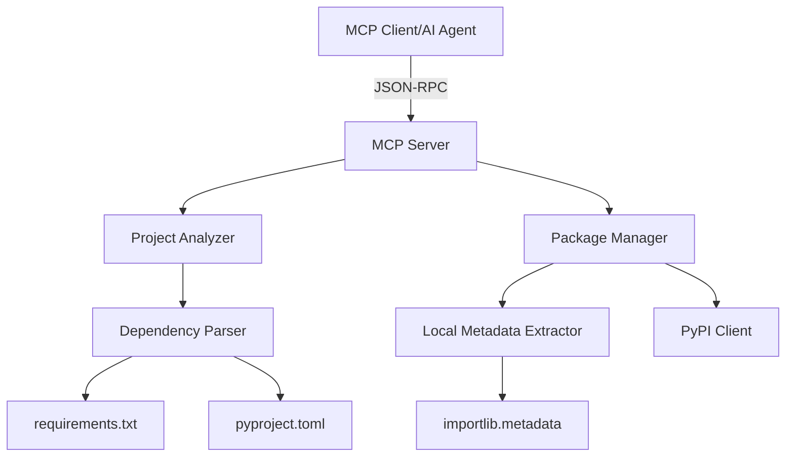

# Design Document

## Overview

The Python Package MCP Server is a local Model Context Protocol server that provides AI coding agents with awareness of Python package ecosystems. The server exposes a minimal set of MCP tools that allow agents to query project dependencies, basic package metadata, and compatibility information.

The server operates as a standalone process that can be configured in MCP clients (like Kiro) and communicates via JSON-RPC. It focuses on core functionality: analyzing dependency files and providing basic package information from PyPI.

## Architecture

### High-Level Architecture



### Component Architecture

The server follows a simple modular architecture:

1. **MCP Server Layer**: Handles protocol communication and tool registration
2. **Service Layer**: Business logic for package analysis and management
3. **Data Access Layer**: Interfaces with PyPI API and local file system

## Components and Interfaces

### 1. MCP Server Core

**Purpose**: Main server entry point that implements the MCP protocol

**Key Classes**:
- `PythonPackageMCPServer`: Main server class inheriting from MCP base server
- `ToolRegistry`: Manages available MCP tools and their handlers

**MCP Tools Exposed**:
- `analyze_project_dependencies`: Scans project for dependency files and returns parsed dependencies
- `get_package_metadata`: Retrieves metadata for a specific package from local installation (using importlib.metadata) or PyPI as fallback
- `search_packages`: Searches PyPI for packages matching functionality requirements

### 2. Project Analyzer

**Purpose**: Analyzes Python project structure and extracts dependency information

**Key Classes**:
- `ProjectAnalyzer`: Main coordinator for project analysis
- `DependencyParser`: Parses dependency file formats

**Interfaces**:
```python
class ProjectAnalyzer:
    def analyze_project(self, project_path: str) -> ProjectInfo
    def get_dependencies(self) -> List[Dependency]

class DependencyParser:
    def parse_requirements_txt(self, file_path: str) -> List[Dependency]
    def parse_pyproject_toml(self, file_path: str) -> List[Dependency]
```

### 3. Package Manager

**Purpose**: Manages package metadata retrieval from local installations and PyPI

**Key Classes**:
- `PackageManager`: Main interface for package operations
- `LocalMetadataExtractor`: Extracts metadata from locally installed packages using importlib.metadata
- `PyPIClient`: Handles PyPI API interactions as fallback

**Interfaces**:
```python
class PackageManager:
    def get_package_info(self, package_name: str) -> PackageInfo
    def search_packages(self, query: str) -> List[PackageSearchResult]

class LocalMetadataExtractor:
    def get_local_package_info(self, package_name: str) -> PackageInfo
    def is_package_installed(self, package_name: str) -> bool
```

## Data Models

### Core Data Models

```python
@dataclass
class Dependency:
    name: str
    version_spec: str
    extras: List[str]
    source_file: str
    is_dev_dependency: bool

@dataclass
class PackageInfo:
    name: str
    version: str
    description: str
    author: str
    license: str
    homepage: str
    repository: str
    keywords: List[str]
    dependencies: List[Dependency]
    python_requires: str
    last_updated: datetime

@dataclass
class PackageSearchResult:
    name: str
    description: str
    version: str
    author: str

@dataclass
class ProjectInfo:
    project_path: str
    dependency_files: List[str]
    dependencies: List[Dependency]
```

## Error Handling

### Error Categories

1. **Network Errors**: PyPI API unavailable, timeout issues
2. **File System Errors**: Dependency files not readable, permission issues
3. **Parsing Errors**: Malformed dependency files, invalid version specifications

### Error Handling Strategy

- **Graceful Degradation**: Return empty results when data sources are unavailable
- **Simple Error Messages**: Provide clear error messages for common issues

## Testing Strategy

### Unit Testing

- **Component Testing**: Test each component independently with mocked dependencies
- **Parser Testing**: Test dependency file format parsers with sample files
- **API Client Testing**: Mock PyPI responses for consistent testing

### Integration Testing

- **End-to-End Workflows**: Test complete workflows from MCP tool calls to responses
- **Real Project Testing**: Test against actual Python projects with requirements.txt and pyproject.toml files

## Implementation Considerations

### Implementation Considerations

- **Local-First Approach**: Prioritize extracting metadata from locally installed packages using `importlib.metadata` (Python 3.8+) or `importlib_metadata` for older versions
- **PyPI Fallback**: Use PyPI API only when packages are not locally installed or local metadata is insufficient
- **Simple Design**: Keep the server stateless and focused on core functionality
- **Input Validation**: Sanitize file paths and package names
- **API Rate Limiting**: Respect PyPI API rate limits when fallback is needed
- **Error Handling**: Provide meaningful error messages for common failure scenarios